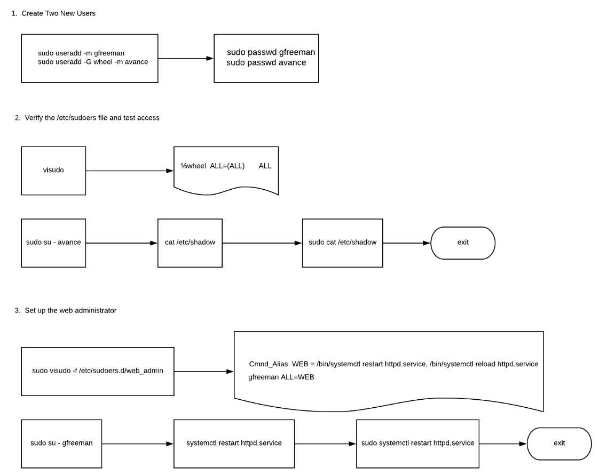

# Create New sudo Users
## About this lab

In a proper production environment, not every user that needs elevated privileges for a server will have the root password. Instead, those users that need to perform system administrative tasks would be granted the ability to use the sudo command when elevated privileges are needed. This learning activity will provide an opportunity to create new users that will be granted varying degrees of sudo access.

## Scenery
You are working at an organization that has just hired two new technicians.

One of them will be the _backup system administrator_, while the other will need the _ability to perform some tasks on the system with elevated privileges_.

You will create these two new accounts, and through the modification of the /etc/sudoers file and a separate sudoers file, these two new users will be able to invoke the sudo command.



## Objetives

* Create two new users.
* Verify the `/etc/sudoers` file and test access.
* Set up the web administrator.

## Introduction
In this hands-on lab, we'll create new users that will be granted varying degrees of **sudo** access.

### Solution
Open a terminal session, and log in via SSH using credentials.

#### Create Two New Users
1. Create a **gfreeman** **user** on the system:

`sudo useradd -m gfreeman`

**-m** will create a directory for the user

2. Create an **avance** user, and **assign** it to the **wheel** **supplemental** group:

`sudo useradd -G wheel -m avance`

**-G** add the user to the group wheel, special group with administration privilages.


3. Set the password for both accounts to **LASudo321**:
```shell
sudo passwd gfreeman


sudo passwd avance
```

####  Verify the `/etc/sudoers File` and Test Access

1. Verify that the /etc/sudoers file will allow the wheel group access to run all commands with sudo:

`sudo visudo`

<details markdown=1>
<summary markdown='span'>más</summary>
<ul>
<li><p>El comando sudo visudo se utiliza para editar el archivo /etc/sudoers en Linux con privilegios de superusuario. El archivo /etc/sudoers contiene la configuración de sudo, que permite a los usuarios ejecutar comandos con privilegios de superusuario.<br><br>

Es importante destacar que el archivo /etc/sudoers no debe ser editado directamente con un editor de texto normal, ya que un error de sintaxis en el archivo puede dejar el sistema inaccesible. En su lugar, se recomienda utilizar el comando visudo para editar el archivo. El comando visudo realiza una verificación de sintaxis antes de guardar los cambios, lo que ayuda a prevenir errores y garantiza que el archivo se mantenga en un estado válido.<br><br>

Al ejecutar sudo visudo, se abrirá el archivo /etc/sudoers en el editor predeterminado, que generalmente es vi o vim. Puedes realizar las modificaciones necesarias en el archivo y guardar los cambios antes de salir del editor. Una vez que hayas guardado los cambios, la configuración de sudo se actualizará de acuerdo con las modificaciones realizadas en el archivo /etc/sudoers.</p></li>
</ul>
</details>


2. Note that there should not be a comment (#) on this line of the file:

/ ## Allows people in grou wheel to run all commands<br>

`%wheel  ALL=(ALL)       ALL`

`:q` to left vim


3. Switch to the avance account, and use the dash (-) to utilize a login shell:

`sudo su - avance`
<details markdown=1>
<summary markdown='span'>más</summary>
<p> El comando sudo su - avance se utiliza para cambiar al usuario "avance" y acceder a su sesión de inicio de sesión en el sistema con privilegios de superusuario. Al ejecutar este comando, se te solicitará ingresar la contraseña del usuario "avance".

La opción - después de su indica que se debe cargar el entorno de inicio de sesión del usuario "avance". Esto significa que se cargarán las variables de entorno y la configuración específica del usuario "avance".

Es importante tener en cuenta que al utilizar el comando sudo, se requiere ingresar la contraseña de administrador para autorizar la ejecución del comando.</p>
</details>


4. Attempt to read the /etc/shadow file at the console:

`cat /etc/shadow`

5. Rerun the command with the sudo command:

`sudo cat /etc/shadow`

6. After you have verified avance can read the /etc/shadow file, log out of that account:

`exit`


####  Set Up the Web Administrator
1. Create a new sudoers file in the /etc/sudoers.d directory that will contain a standalone entry for webmasters:

sudo visudo -f /etc/sudoers.d/web_admin
2. Enter in the following at the top of the file:

`Cmnd_Alias  WEB = /bin/systemctl restart httpd.service, /bin/systemctl reload httpd.service`
3. Add another line in the file for gfreeman to be able to use the sudo command in conjunction with any commands listed in the WEB alias:

`gfreeman ALL=WEB`

4. Save and close the file with `:wq!`.


5. Next, log in to the gfreeman account:

`sudo su - gfreeman`

6. Attempt to restart the web service:

sudo systemctl restart httpd.service
7. Try to read the new web_admin sudoers file:

`sudo cat /etc/sudoers.d/web_admin`

Since the cat command is not listed in the command alias group for WEB, gfreeman cannot use sudo to read this file.