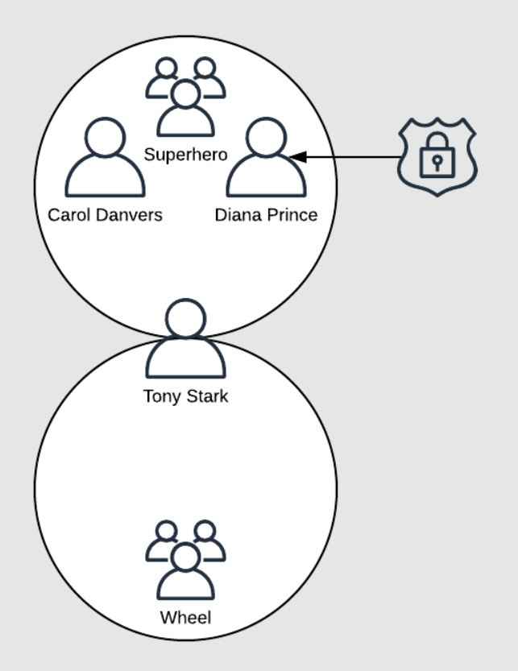

## Description
In this lab, we are going to manage users and groups to get some practice using these utilities. Knowing how to manage users and permissions means our servers will be more secure.

## Scenery
We have some users that need to be set up on a new machine.

Tony Stark, Diana Prince, and Carol Danvers are developers for a project we're involved with. 

We need to add user accounts for them to the server, and then create the **superhero group** for all of them to be members of.

Tony Stark is a superuser, so we'll replace his primary group with the **wheel** group.

But wait! We realize a couple weeks in that Diana Prince has been forced to take leave, in order to fight evil. We'll have to lock her account until she can return.

To get started, log in to the lab server using the credentials provided and then become **root** by running:

`sudo -i`




## Objectives
* Add the Users to the Server
* Create the `superhero` Group
* Set `wheel` Group as the the `tstark` Account's Primary Group
* Add `superhero` as a Supplementary Group on All Three Users
* Lock the `dprince` Account

# Managing Users in Linux


## Introduction
In this lab we are going to manage users and groups to get some practice using these utilities. Knowing how to manage users and permissions means our servers will be more **secure**.

## Solution
Log in to the server 
`ssh cloud_user@<PUBLIC_IP_ADDRESS>
`
Become root:

`sudo -i
`

Enter password at the prompt.

1. Add the Users to the Server:

```shell
useradd tstark
useradd cdanvers
useradd dprince
Create the superhero Group

```

2. Create the new group:

`groupadd superhero`

3. Set wheel Group as the the tstark Account's Primary Group

The usermod command will change which group a user is in. Change tstark:

`usermod -g wheel tstark`


Make sure it worked:

`id tstark`


The command's output should show his primary group is now wheel.

4. Add superhero as a Supplementary Group on All Three Users
4.1. Run the usermod command for each user:
```shell
usermod -aG superhero tstark
usermod -aG superhero dprince
usermod -aG superhero cdanvers
```

Check with any of the users to make sure it worked:

`id <USERNAME>
`

We should see they're now in superhero, as well as their own groups.

5. Lock the dprince Account
Run the following:

`sermod -L dprince
`
